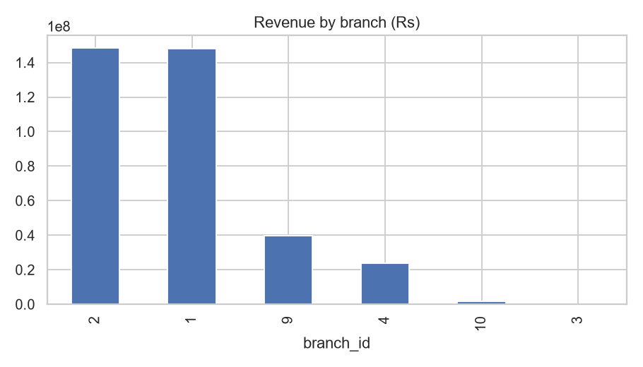
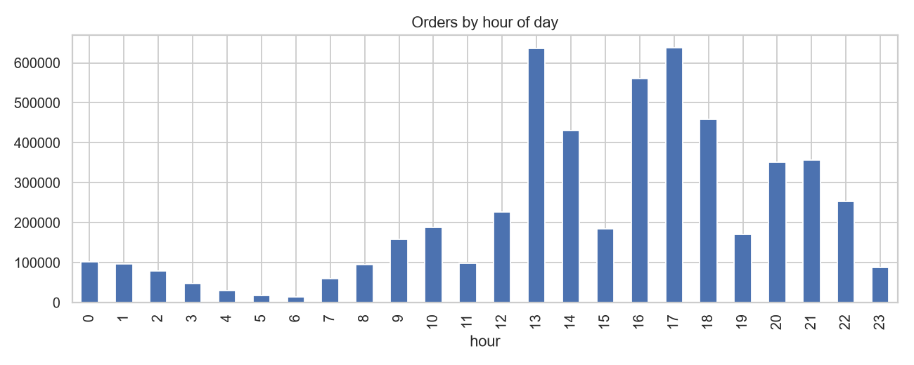
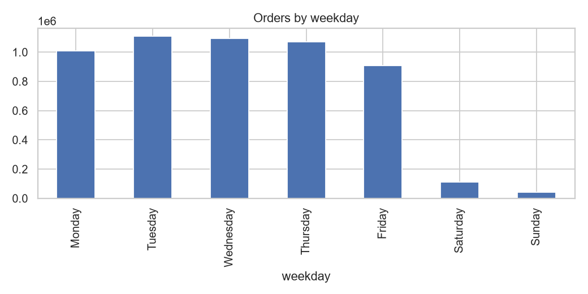
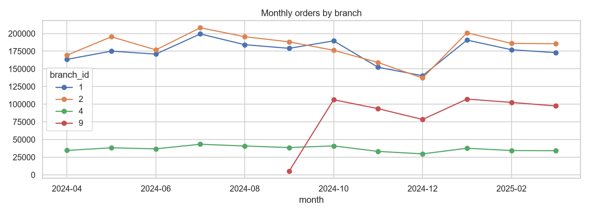
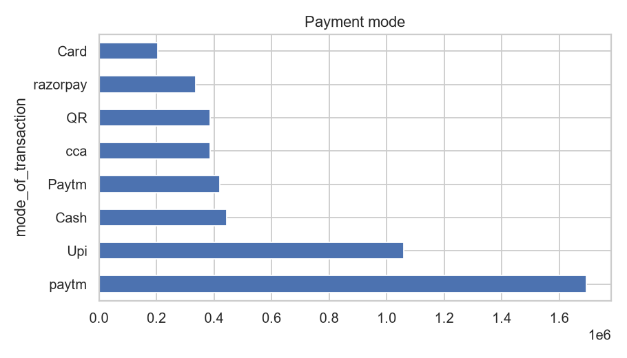
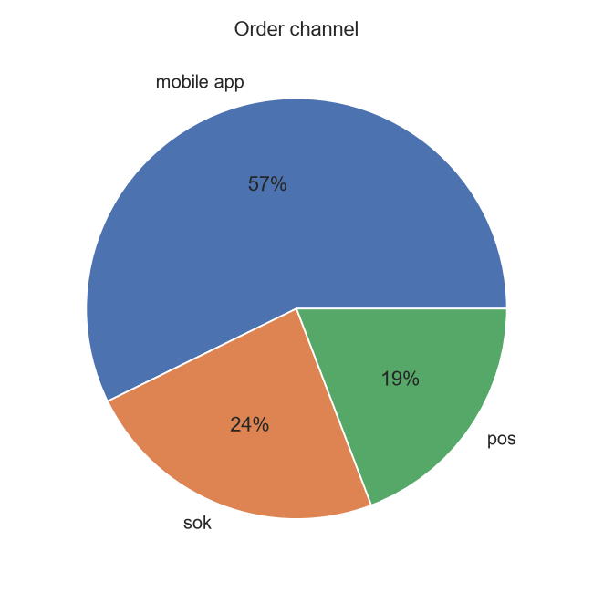
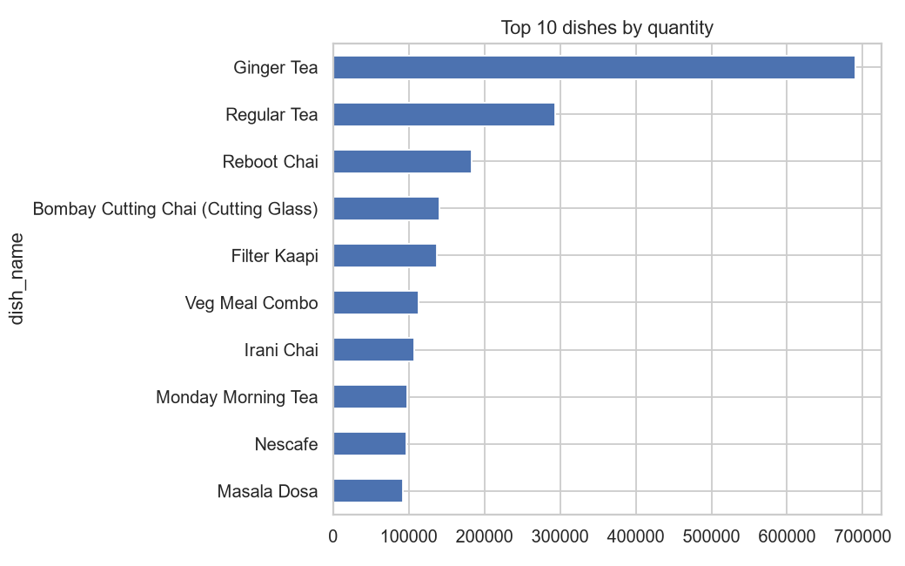
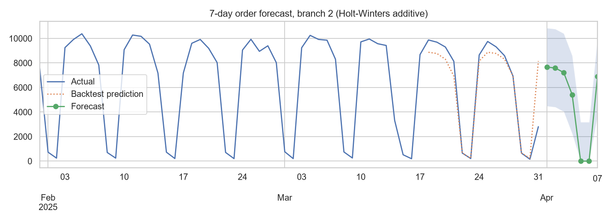
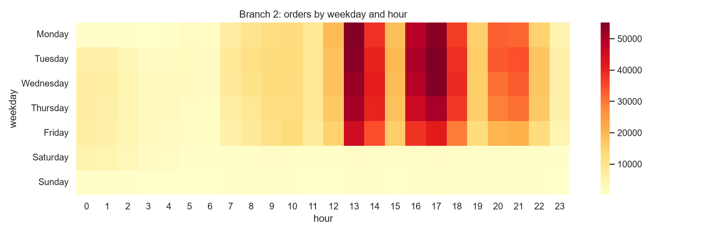

# Cafeteria Order Data: Analysis and 7-Day Forecast

## 📌 Executive Summary

This project analyzes cafeteria order data for the financial year **FY 2024–25**, covering approximately **5.96 million order records** across multiple branches and counters.

The analysis focuses on:

- Data extraction and cleaning from a large SQL dump
- Exploratory Data Analysis (EDA)
- Branch, time, payment, channel, and menu-item analysis
- Identification of operational and customer-order patterns
- Time-series forecasting of the next **7 days of orders** for a selected branch
- Comparison of forecasting approaches using historical holdout data
- Business-oriented insights and recommendations

### 🎯 Key Findings

- **Branch 1 and Branch 2** account for the majority of order volume in the dataset.
- Order demand varies considerably by **branch, weekday, and operating hour**.
- A relatively small group of menu items contributes a significant share of order volume.
- Digital ordering channels represent a substantial proportion of total orders.
- **Branch 10 shows a notably higher cancellation rate (~18%)** compared with the major branches and may warrant further operational investigation.
- Average ticket size varies across branches, indicating differences in customer purchasing patterns.
- Historical demand patterns were used to generate a **7-day forecast** for the selected branch.

> **Note:** The findings above are descriptive observations from the available dataset and should be interpreted in the context of the provided data and its limitations.

Kanishka Software internship challenge. Python (pandas, statsmodels, matplotlib, seaborn).

## 1. Approach
The SQL dump is 11 GB, so importing it into MySQL was impractical in 24 hours. `extract_csv.py` streams the dump once and writes only the needed columns of `orders` (5.96M rows) and `order_details` (7.43M rows) to CSV. `analysis.py` then does the cleaning, EDA and forecast. The CSVs are not in the repo because of size. Data range: 2024-04-01 to 2025-03-31.

## 2. Cleaning
- Dates and amounts parsed; no unparseable rows, no duplicate order ids.
- 1 order with an invalid branch id (-1) removed.
- 2025-04-01 is a partial day (data ends 17:11), so it was excluded.
- Only `paid` orders count as sales (5.44M). Cancelled (0.40M), pending (0.11M) and rejected (138) orders are excluded and analysed only as cancel rates.
- 96,199 zero-value orders and 314 orders above Rs 5,000 were dropped as test or outlier entries (raw max was about Rs 996,000).
- Final: 5,338,959 paid orders.

## 3. Key insights
- **Two branches carry the business.** Branch 2 (2.18M orders, Rs 148.4M) and Branch 1 (2.10M orders, Rs 148.0M) make up about 80% of orders. Branch 9 is third (0.59M orders). Branch 3 and 10 are marginal.
- **Weekday-driven demand.** Monday to Thursday run about 1.0 to 1.1M orders each, Friday drops to 0.91M, and Saturday (0.11M) and Sunday (0.04M) are almost empty. This looks like an office or campus cafeteria.
- **Peak hours** are 17:00, 13:00 and 16:00 (see `02_orders_by_hour.png` and the heatmap). Timestamps are used as recorded.
- **Mobile ordering dominates:** 57% of orders come through the mobile app, 24% via kiosks (sok) and 19% at the POS.
- **Payments are mostly digital.** Paytm is about 40% (labels "paytm" and "Paytm" are inconsistent and should be merged), then UPI, with cash only about 8%.
- **Tea drives volume.** Ginger Tea is the top item by quantity (690k) and by revenue (Rs 10.5M); the top 10 by quantity are mostly tea and coffee. Meal combos (Tandoor Veg Combo, Veg Meal, Indian Thali) lead the rest of the revenue.
- **Cancel rate** is 6.7 to 7.7% for the main branches but 18% for Branch 10. Branch 4 shows 0.0%, which probably means cancellations are not recorded there.

## 4. Forecast (Branch 2, next 7 days)
Branch 2 is the busiest branch. The series is daily paid-order counts (365 days, mean about 5,969 per day).

I compared a seasonal-naive baseline with three Holt-Winters variants (weekly seasonality) on a 14-day holdout:

| Model | MAE | MAPE % |
|---|---|---|
| Seasonal naive | 974.6 | 26.1 |
| **Holt-Winters additive (selected)** | **842.6** | 23.2 |
| Holt-Winters damped trend | 850.9 | 23.4 |
| Holt-Winters no trend | 842.9 | 22.8 |

Forecast, with an approximate 95% band from backtest residuals (see `outputs/forecast_next_7_days.csv`):

| Date | Day | Orders | Range |
|---|---|---|---|
| 2025-04-01 | Tue | 7,667 | 4,485 to 10,849 |
| 2025-04-02 | Wed | 7,587 | 4,405 to 10,769 |
| 2025-04-03 | Thu | 7,221 | 4,039 to 10,403 |
| 2025-04-04 | Fri | 5,413 | 2,231 to 8,595 |
| 2025-04-05 | Sat | about 0 | 0 to 3,182 |
| 2025-04-06 | Sun | about 0 | 0 to 3,182 |
| 2025-04-07 | Mon | 6,916 | 3,734 to 10,098 |

## 5. Limitations
- Holt-Winters beats the baseline, but a MAPE of about 23% is mediocre. The data has no holiday calendar, and the 14-day test window may contain holidays or demand shifts.
- The weekend forecast is clipped at 0; real weekend volume is small but not zero.
- Only one year of data, so yearly seasonality cannot be learned.
- Branches are labelled by id; the branch name table was not used.
- Timestamps are used as recorded, with no timezone conversion.

## 6. Recommendations
1. Staff to the 13:00 and 16:00 to 17:00 peaks, and use the heatmap for shift planning.
2. Scale operations to the weekday pattern; run a leaner weekend or promotions to lift weekends.
3. Keep tea and coffee stock highest; promote combos to raise the average ticket.
4. Investigate the 18% cancel rate at Branch 10 and the missing cancel data at Branch 4.
5. Standardise payment mode labels and push the mobile app, which already carries most orders.
6. Next step for the forecast: add a holiday calendar and weekday-specific models, and forecast per branch.

## How to run
```bash
pip install -r requirements.txt
python extract_csv.py   # streams the 11 GB SQL dump into data/*.csv (set the BIG path inside the script)
python analysis.py      # cleaning, EDA, forecast, charts into outputs/
```

- `queries.sql`: SQL equivalents of the main analyses (written for SQLite, not executed in this submission)

## Files
- `extract_csv.py`: streams the SQL dump into CSV
- `analysis.py`: cleaning, EDA, forecast
- `outputs/`: charts (01 to 09), `forecast_next_7_days.csv`, `branch_summary.csv`, `top_dishes.csv`, `REPORT_auto.md`

## Charts

### Revenue by branch


### Orders by hour of day


### Orders by weekday


### Monthly orders by branch


### Payment modes


### Order channel


### Top 10 dishes


### 7-day forecast (Branch 2)


### Weekday x hour heatmap (Branch 2)

